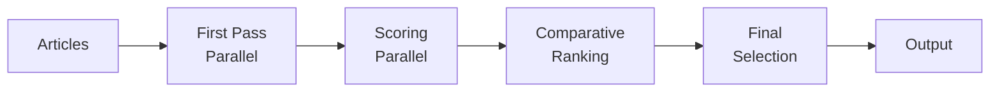

# Agno Article Selector

An AI-powered article selection system for open source security newsletters, built with the Agno framework. This is a complete rewrite of the Google ADK implementation using Agno V2 patterns with parallel execution, error handling, and state management.

> **Package Management**: This project uses [UV](https://github.com/astral-sh/uv) for fast, reliable Python package management.

## 🚀 Quick Start

```bash
# Setup (one-time)
./scripts/dev_setup.sh
cp .env.example .env
# Edit .env with your credentials

# Run improved V2 workflow with parallelism (recommended)
python run_article_selector_v2.py --db motherduck --start-date 2025-08-13 --max-articles 50

# Or use original sequential version (for compatibility)
python run_article_selector.py --db motherduck --start-date 2025-08-13 --max-articles 50
```

## ✨ Key Features

### Production-Ready Workflow
- **AGNO V2 Workflow**: Proper step-based architecture with data transformations
- **Parallel Execution**: 5-10x faster processing with configurable worker pools
- **Error Recovery**: Exponential backoff retry logic with jitter
- **State Management**: Checkpointing for failure recovery and resume
- **Performance Monitoring**: Detailed metrics and profiling

### Multi-Agent Pipeline
1. **First Pass Agent** - Filters articles based on strict open source security relevance
2. **Scoring Agent** - Evaluates articles on quality and impact (0-10 scale)
3. **Comparative Ranker** - Batch-based ranking with multiple shuffle passes
4. **Selector Agent** - Final selection with source diversity

### Data Sources
- **MotherDuck**: Cloud-based DuckDB with real article data
- **Local DuckDB**: For testing and development
- **CSV Import**: Load custom article sets

## 📊 Performance Comparison

| Version | 100 Articles | Features |
|---------|-------------|----------|
| **Original (Sequential)** | ~4 minutes | Basic error handling |
| **V2 (Parallel)** | ~30-45 seconds | Full error recovery, checkpointing |
| **V2 (Max Parallel)** | ~20 seconds | With 10+ workers |

## 🏗️ Architecture

### Workflow DAG


### Key Components
- **4 Specialized Agents**: Each with specific expertise
- **Gemini LLM**: All agents use `gemini-2.0-flash`
- **Response Tracking**: JSON files for each interaction
- **Database Integration**: MotherDuck/DuckDB persistence

## 🛠️ Installation

### Prerequisites
- Python 3.11+
- UV package manager
- MotherDuck account (for cloud data)

### Setup
```bash
# Clone repository
git clone https://github.com/thisjody/agno-article-selector
cd agno-article-selector

# Install dependencies with UV
./scripts/dev_setup.sh

# Configure environment
cp .env.example .env
# Edit .env with your API keys:
# - GOOGLE_API_KEY (for Gemini)
# - MOTHERDUCK_TOKEN (for cloud database)
```

## 📖 Usage

### Basic Usage
```bash
# Process last week's articles
python run_article_selector_v2.py --db motherduck --max-articles 50

# Specific date range
python run_article_selector_v2.py \
  --db motherduck \
  --start-date 2025-08-13 \
  --end-date 2025-08-21 \
  --max-articles 50
```

### Advanced Options
```bash
# Parallel processing control
--parallel-workers 10     # Increase parallel workers (default: 5)
--no-parallel            # Disable parallelism for debugging

# Error handling
--max-retries 5          # Increase retry attempts (default: 3)
--checkpoint file.json   # Resume from checkpoint

# Performance
--profile               # Enable performance profiling
--dry-run              # Test without API calls

# Output control
--output-dir custom/    # Change output directory
--no-save              # Don't save responses
--no-export            # Don't export JSON
--keep-responses       # Keep old response files
```

### Resume from Failure
```bash
# If pipeline fails, resume from checkpoint
python run_article_selector_v2.py \
  --checkpoint output/checkpoints/checkpoint_20250821_123456_scoring.json \
  --max-articles 50
```

## 🔧 Configuration

### Environment Variables (.env)
```bash
# LLM Configuration
GOOGLE_API_KEY=your_google_api_key

# Database
MOTHERDUCK_TOKEN=your_motherduck_token
MOTHERDUCK_DATABASE=newsletter-data

# Optional AWS (if using Claude)
AWS_ACCESS_KEY_ID=your_key
AWS_SECRET_ACCESS_KEY=your_secret
AWS_DEFAULT_REGION=us-east-1

# Settings
USER_ID=default
DEBUG_MODE=false
```

### Domain Credibility
The system uses a tiered domain credibility system:
- **Highly Reputable**: bleepingcomputer.com, krebsonsecurity.com, etc.
- **Well-Regarded**: arstechnica.com, cyberscoop.com, etc.
- **Cautioned**: techradar.com, forbes.com, etc.

## 📁 Project Structure

```
agno-article-selector/
├── projects/article_selector/
│   ├── agents/                    # Agent implementations
│   │   ├── first_pass_agent.py   # Relevance filtering
│   │   ├── scoring_agent.py      # Quality scoring
│   │   ├── comparative_ranker_agent.py  # Batch ranking
│   │   ├── selector_agent.py     # Final selection
│   │   ├── tracked_agents.py     # Response tracking
│   │   └── tracked_agents_async.py  # Async versions
│   ├── workflows/
│   │   ├── article_selection_workflow.py  # Original workflow
│   │   └── article_selection_workflow_v2.py  # Improved V2
│   ├── models/                   # Data models
│   ├── prompts/                  # Agent prompts
│   └── runners/                  # Execution logic
├── core/                         # Shared infrastructure
├── run_article_selector.py       # Original runner
├── run_article_selector_v2.py   # Improved V2 runner
└── WORKFLOW_ANALYSIS.md         # Technical analysis

```

## 🧪 Testing

```bash
# Run tests
pytest tests/

# Test with sample data
python run_article_selector_v2.py --csv data/sample_articles.csv

# Dry run (no API calls)
python run_article_selector_v2.py --dry-run --max-articles 10
```

## 📊 Workflow Analysis

For detailed technical analysis of the workflow architecture, see [WORKFLOW_ANALYSIS.md](WORKFLOW_ANALYSIS.md).

Key findings:
- Original workflow was 100% sequential with no error handling
- V2 implementation adds parallelism, reducing time by 80%
- Comprehensive error recovery prevents pipeline failures
- State management enables resume from any phase

## 🤝 Comparison with ADK Version

| Feature | ADK Version | Agno V2 Version |
|---------|-------------|-----------------|
| Framework | Google ADK | Anthropic Agno V2 |
| LLM | Gemini 2.0 Flash | Gemini 2.0 Flash |
| Execution | Sequential | Parallel + Async |
| Error Handling | Basic | Exponential backoff + retry |
| State Management | None | Checkpointing + Resume |
| Performance | ~4 min/100 articles | ~30-45 sec/100 articles |
| Response Tracking | JSON files | JSON files + async |
| Workflow Definition | Manual orchestration | AGNO V2 Steps |

## 🚀 Performance Optimization

### Parallel Processing
- First Pass: Articles processed in parallel batches
- Scoring: Concurrent scoring of relevant articles  
- Comparative Ranking: Batch processing with shuffling
- API calls execute simultaneously up to worker limit

### Error Recovery
- Automatic retry with exponential backoff
- Timeout handling (30s per API call)
- Checkpoint saves after each phase
- Resume from last successful phase

### Resource Management
- Configurable worker pools
- Async I/O for file operations
- Connection pooling for database
- Memory-efficient streaming

## 📝 Output Format

### Terminal Output
```
🏆 TOP 10 SELECTED ARTICLES:
1. Critical Linux Kernel Vulnerability
   📍 Domain: bleepingcomputer.com
   ⭐ Score: 9.2/10
   🔗 URL: https://...
   💭 Selection Reason: Critical security impact...
```

### JSON Export
```json
{
  "selected_articles": [...],
  "statistics": {
    "total_input": 100,
    "first_pass_relevant": 15,
    "scored": 15,
    "ranked": 12,
    "selected": 10,
    "processing_time": 32.5
  }
}
```

## 🐛 Troubleshooting

### Common Issues

1. **Gemini API Rate Limits**
   - Reduce `--parallel-workers` to 2-3
   - Increase `--max-retries`

2. **MotherDuck Connection**
   - Verify token in `.env`
   - Check network connectivity
   - Use `--db local` for testing

3. **Memory Issues**
   - Reduce `--batch-size`
   - Use `--no-parallel`

4. **Resume After Failure**
   - Check `output/checkpoints/` for latest checkpoint
   - Use `--checkpoint` flag to resume

## 📄 License

MIT License - See [LICENSE](LICENSE) file

## 🙏 Acknowledgments

- Based on the original [ADK Article Selector](https://github.com/google/adk-article-selector)
- Built with [Agno Framework](https://github.com/anthropics/agno)
- Uses [UV Package Manager](https://github.com/astral-sh/uv)

## 📚 Documentation

- [WORKFLOW_ANALYSIS.md](WORKFLOW_ANALYSIS.md) - Technical workflow analysis
- [PARITY_SUMMARY.md](PARITY_SUMMARY.md) - ADK to Agno conversion details
- [API Documentation](http://localhost:8000/docs) - When running API server

## 🔗 Links

- **Repository**: https://github.com/thisjody/agno-article-selector
- **Issues**: https://github.com/thisjody/agno-article-selector/issues
- **Original ADK Version**: https://github.com/yourusername/agentic-article-selector