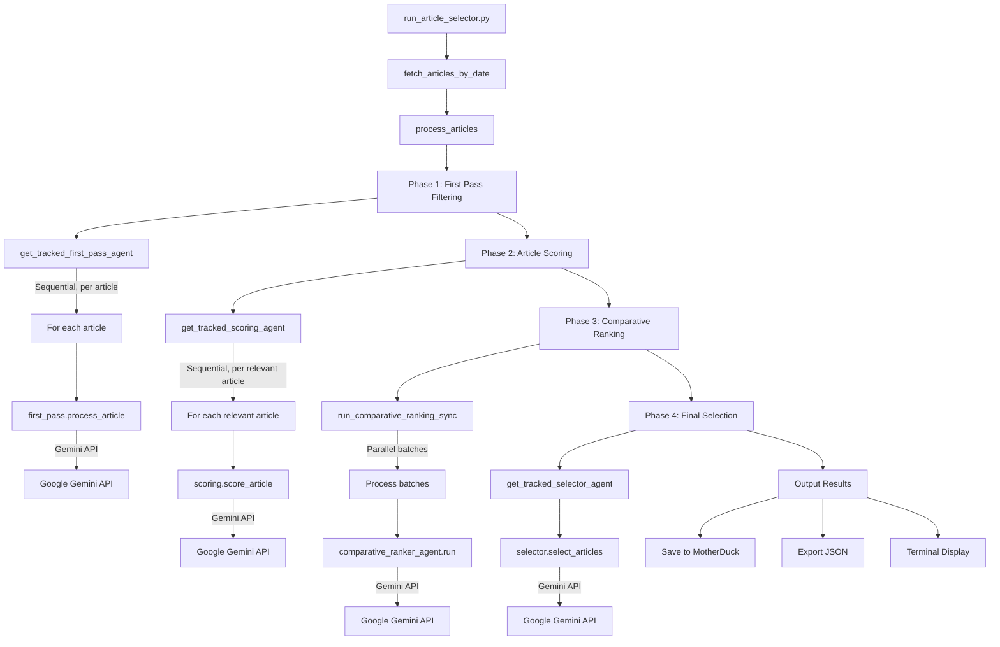

# Workflow DAG Analysis - Agno Article Selector

## 1. Actual Data Flow (Component Call Graph)



## 2. External API Dependencies & Failure Modes

### 2.1 Primary Dependencies

| Component | External API | Purpose | Failure Mode | Recovery Strategy |
|-----------|-------------|---------|--------------|-------------------|
| All Agents | Google Gemini (`gemini-2.0-flash`) | LLM inference | Timeout, Rate limit, API error | None - fails pipeline |
| Database | MotherDuck | Article source & results storage | Connection failure, Auth error | Falls back to local DuckDB |
| Response Tracking | Local filesystem | JSON response storage | Disk full, Permission denied | Continues without saving |

### 2.2 API Call Patterns

```python
# Sequential API calls (blocking):
Phase 1: N articles × 1 Gemini call each
Phase 2: M relevant × 1 Gemini call each  
Phase 3: 3 shuffles × B batches × 1 Gemini call each
Phase 4: 1 Gemini call total

# Total API calls for 100 articles (typical):
- First Pass: 100 calls
- Scoring: ~10 calls (10% pass rate)
- Comparative: 3 × 2 = 6 calls (2 batches)
- Selection: 1 call
Total: ~117 Gemini API calls
```

## 3. Data Transformations at Each Step

### Phase 1: First Pass Filtering
```python
Input: {
    'title': str,
    'content': str,
    'url': str,
    'domain': str,
    'published_date': datetime
}
↓
Transform: Article object + prompt formatting
↓
Output: {
    'status': 'Relevant' | 'Irrelevant',
    'reasoning': str,
    'result': AgentResponse
}
```

### Phase 2: Article Scoring  
```python
Input: Article + first_pass_reasoning
↓
Transform: Add context from Phase 1
↓
Output: {
    **article_data,
    'overall_score': float (7.0-10.0),
    'scoring_response': str
}
```

### Phase 3: Comparative Ranking
```python
Input: List[ScoredArticle]
↓
Transform: 
  - Filter by score_threshold (6.0)
  - Create batches of 10
  - Shuffle 3 times
  - Accumulate rankings
↓
Output: List[{
    **article_data,
    'comparative_avg_rank': float,
    'comparative_rationales': List[str]
}]
```

### Phase 4: Final Selection
```python
Input: Comparative ranked articles
↓
Transform: Top N selection
↓
Output: {
    'selected_articles': List[Article],
    'statistics': dict,
    'processing_time': float
}
```

## 4. Parallel vs Sequential Execution

### Sequential Operations (Blocking)
1. **Phase 1**: Articles processed one-by-one
2. **Phase 2**: Scored one-by-one  
3. **Phase 4**: Single selection call
4. **Database operations**: All sequential

### Potentially Parallel (But Currently Sequential)
1. **Phase 3 Batches**: Could process batches in parallel but doesn't
   ```python
   # Current: Sequential
   for batch in batches:
       result = ranker_agent.run(batch)
   
   # Could be: Parallel
   results = asyncio.gather(*[
       ranker_agent.run(batch) for batch in batches
   ])
   ```

### Actual Parallelism
**NONE** - All operations are synchronous and sequential

## 5. AGNO V2 Workflow Assessment

### 5.1 What's Imported vs Used

```python
# IMPORTED in article_selection_workflow.py:
from agno.workflow.v2 import Step, Workflow

# DEFINED but NEVER CALLED:
workflow = Workflow(
    name="Article Selection Pipeline",
    steps=[
        Step("First Pass", first_pass),
        Step("Scoring", scoring),
        Step("Selection", selector),
    ]
)

# ACTUAL USAGE:
# The workflow object is created but workflow.run() is NEVER called
# Instead, agents are called directly in run_article_selector.py
```

### 5.2 Step-Based Architecture Implementation

**NOT IMPLEMENTED** - The V2 workflow architecture is:
- ✅ Defined (workflow object exists)
- ❌ Not executed (workflow.run() never called)
- ❌ Missing ComparativeRanker step
- ❌ No data transformation between steps
- ❌ No state management

### 5.3 Current State Management

```python
# Manual state management via dictionaries:
relevant_articles = []  # Phase 1 output
scored_articles = []    # Phase 2 output  
comparative_results = [] # Phase 3 output
selected_articles = []  # Phase 4 output

# No workflow context or state persistence
# No retry/resume capability
# No failure recovery
```

## 6. Key Findings

### 6.1 Architecture Reality
- **V2 Workflow**: Defined but completely unused
- **Actual Pattern**: Direct agent orchestration mimicking ADK
- **State Management**: Manual via Python lists/dicts
- **Parallelism**: None despite opportunities

### 6.2 Critical Issues
1. **No error handling**: Any API failure crashes pipeline
2. **No retries**: Transient failures are fatal
3. **No checkpointing**: Can't resume from failure
4. **Sequential bottleneck**: ~117 serial API calls for 100 articles
5. **Workflow unused**: V2 benefits not realized

### 6.3 Performance Implications
```
100 articles × ~2 sec/API call = ~234 seconds (4 minutes)
With parallelism: Could be ~30 seconds
```

## 7. Recommendations

### Immediate (No Architecture Change)
1. Add try/except blocks around API calls
2. Implement exponential backoff retry logic
3. Add timeout parameters to API calls
4. Save intermediate results for recovery

### Medium-Term (Use V2 Properly)
1. Implement workflow.run() with proper steps
2. Add ComparativeRanker to workflow
3. Implement transform functions between steps
4. Use workflow state management

### Long-Term (Full Optimization)
1. Parallelize API calls within phases
2. Implement async/await patterns
3. Add caching for repeated content
4. Stream results instead of batch processing